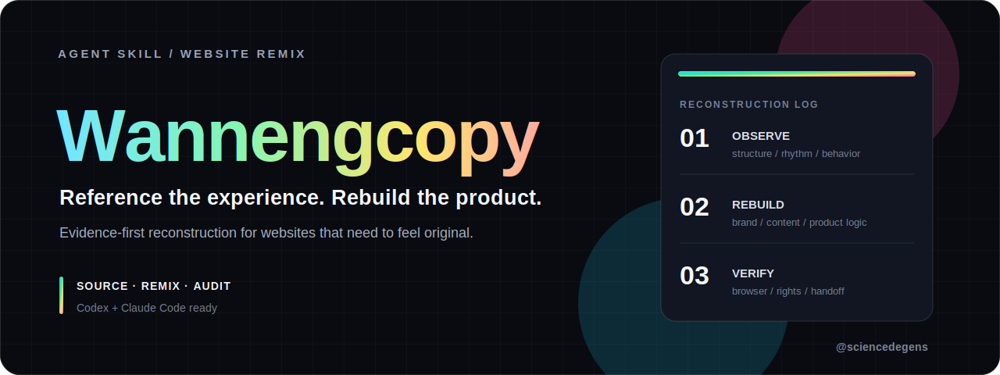

<p align="center">
  
</p>

<p align="center">
  <a href="./README.zh-CN.md">中文</a>
  ·
  <a href="#install">Install</a>
  ·
  <a href="#workflow">Workflow</a>
  ·
  <a href="#operating-modes">Modes</a>
  ·
  <a href="https://x.com/sciencedegens">X / @sciencedegens</a>
</p>

<p align="center">
  <a href="https://github.com/wuxie888/agent-skill-wannengcopy/blob/main/LICENSE"></a>
  <a href="https://github.com/wuxie888/agent-skill-wannengcopy"></a>
  
  
  <a href="https://x.com/sciencedegens"></a>
</p>

## Overview

Wannengcopy is a reusable Skill for turning a reference website into an original product website.

It supports authorized exact cloning when you own the source or have explicit permission. By default, it uses an experience-remix workflow: preserve the reference site's structure, interaction feel, motion language, visual rhythm, and product-quality polish while replacing protected surfaces with original product copy, assets, flows, and calls to action.

<table>
  <tr>
    <td><strong>Evidence First</strong><br />Inspect source, screenshots, routes, motion, APIs, and implementation confidence before building.</td>
    <td><strong>Product First</strong><br />Keep the target product's user, action, workflow, copy, assets, and CTAs at the center.</td>
    <td><strong>Audit Before Handoff</strong><br />Verify browser behavior, reference leakage, rights risk, motion proof, and product logic.</td>
  </tr>
</table>

## Install

### Codex

```bash
mkdir -p ~/.codex/skills
git clone \
  https://github.com/wuxie888/agent-skill-wannengcopy.git \
  ~/.codex/skills/wannengcopy
```

### Claude Code

```bash
mkdir -p ~/.claude/skills
git clone \
  https://github.com/wuxie888/agent-skill-wannengcopy.git \
  ~/.claude/skills/wannengcopy
```

Then ask your agent:

```text
Use wannengcopy to remix this reference site into an original product website: https://...
```

## When To Use

Use Wannengcopy when you want to:

- remix a reference landing page into your own product website
- rebuild a site with the same interaction rhythm but different product logic
- migrate Linear, Raycast, Apple, Vercel, or RMUX-style page quality into another domain
- reconstruct hero motion, scroll choreography, Canvas, WebGL, Three.js, Lottie, or video-led sections
- inspect a reference site with evidence before deciding what to preserve
- repair a previous clone/remix that looks good but still has weak product logic

## Workflow

```text
reference website
  -> evidence recon
  -> legal/product mode
  -> complexity level
  -> module mapping
  -> original implementation
  -> browser verification
  -> leakage audit
  -> product logic QA
```

## Operating Modes

| Mode | Purpose |
|---|---|
| Authorized Exact Clone | Use only when you own the source or have explicit authorization. |
| Experience Remix | Default. Preserve feel and structure, replace protected surfaces. |
| Product Rebuild | Use a reference site as a quality bar for a different product. |
| Motion Reconstruction | Focus on hero motion, scroll rhythm, Three.js, WebGL, Canvas, Lottie, or video. |
| QA / Repair | Fix product mismatch, leaked assets, bad CTAs, weak motion, or wrong sections. |

## Complexity Levels

| Level | Type | Delivery stance |
|---|---|---|
| L1 | Static HTML/CSS | Exact if authorized; otherwise clean remix. |
| L2 | CMS or company content site | Recreate representative templates, not CMS backend. |
| L3 | React / Vue / Next content frontend | Rebuild with target stack and fixtures. |
| L4 | Animation-heavy brand site | Preserve rhythm and mood; simplify microdetails when needed. |
| L5 | WebGL / Canvas / Three.js | Source-first teardown; choose motion Level B/C/D consciously. |
| L6 | SaaS / ecommerce / logged-in system | Clone demo surface and states only; do not clone backend logic. |

## Evidence Labels

| Label | Meaning |
|---|---|
| `SOURCE` | Direct evidence such as repo lines, source maps, DOM capture, shader text, network response, screenshot, or frame capture. |
| `PARTIAL` | Useful clue but not enough for a verified claim. |
| `GUESS` | Visual or conceptual inference that must not be treated as fact. |

## Output

The agent using this Skill should produce:

- reference capture summary
- legal/product mode decision
- module mapping table
- motion level choice
- original product copy and assets
- browser verification evidence
- reference leakage audit
- product-logic QA notes

## Layout

```text
agent-skill-wannengcopy/
├── SKILL.md
├── agents/
│   └── openai.yaml
├── assets/
│   └── cover.svg
├── references/
│   ├── copy-modes.md
│   ├── evidence-recon.md
│   ├── motion-levels.md
│   ├── product-logic-qa.md
│   └── verification-audit.md
├── LICENSE
└── README.md
```

## Example Prompts

```text
Use wannengcopy to remix this reference site into an original product website.
```

```text
Use wannengcopy to reconstruct the hero motion without reusing reference assets.
```

```text
Use wannengcopy to audit why this remix looks good but feels wrong.
```

## Rights Boundary

Publicly accessible code, screenshots, videos, or deployed assets are not automatically safe to ship. If ownership or license is unclear, use the reference as evidence and rebuild original target-product surfaces.

## Follow

Built and maintained by [@sciencedegens](https://x.com/sciencedegens).

## Credits

Wannengcopy's evidence-recon layer is influenced by source-first web-clone workflows, including Jane Xiaoer's [`claude-skill-web-clone`](https://github.com/Jane-xiaoer/claude-skill-web-clone) methodology.

This project keeps the product-remix goal as the main workflow and uses recon as an inspection and verification subsystem.

## License

MIT. See [LICENSE](LICENSE).
