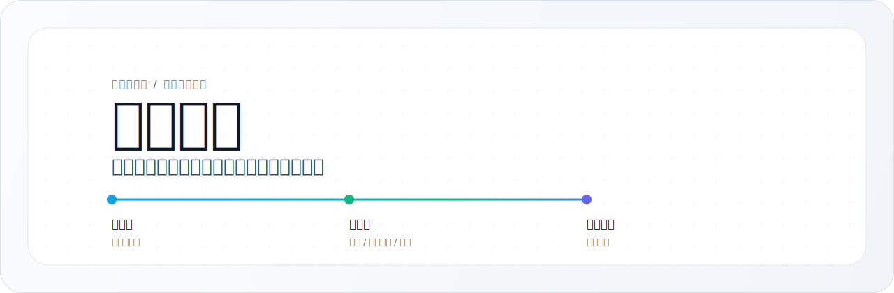

<p align="center">
  
</p>

<h1 align="center">万能复刻</h1>

<p align="center">
  面向智能体 Skill 系统的网站体验复刻与产品化重构工作流。
</p>

<p align="center">
  <a href="./README.md">English</a>
  ·
  <a href="#安装">安装</a>
  ·
  <a href="#工作流">工作流</a>
  ·
  <a href="#运行模式">运行模式</a>
  ·
  <a href="https://x.com/sciencedegens">X / @sciencedegens</a>
</p>

<p align="center">
  <a href="https://github.com/wuxie888/agent-skill-wannengcopy/blob/main/LICENSE"></a>
  <a href="https://github.com/wuxie888/agent-skill-wannengcopy"></a>
  
  
  <a href="https://x.com/sciencedegens"></a>
</p>

## 这是什么

万能复刻是一个可复用的 Skill，用来把参考网站改造成你自己的产品官网。

如果你拥有原站或拥有明确授权，它可以用于一比一复刻。默认情况下，它采用「体验重构」：保留参考站的信息结构、交互手感、动效语言、滚动节奏和高级感，同时把受保护的品牌、文案、素材、截图、视频、产品逻辑和行动路径替换成你自己的内容。

<table>
  <tr>
    <td><strong>先取证</strong><br />先看源码、截图、路由、动效、接口和实现证据，再决定怎么做。</td>
    <td><strong>再产品化</strong><br />始终围绕目标产品的用户、动作、流程、文案、素材和 CTA 重建。</td>
    <td><strong>最后验收</strong><br />检查浏览器表现、原站残留、版权风险、动效证据和产品逻辑。</td>
  </tr>
</table>

## 安装

### Codex

```bash
mkdir -p ~/.codex/skills
git clone \
  https://github.com/wuxie888/agent-skill-wannengcopy.git \
  ~/.codex/skills/wannengcopy
```

### Claude Code

```bash
mkdir -p ~/.claude/skills
git clone \
  https://github.com/wuxie888/agent-skill-wannengcopy.git \
  ~/.claude/skills/wannengcopy
```

然后对你的智能体说：

```text
用 wannengcopy 参考这个官网做我们的产品页：https://...
```

## 什么时候用

适合这些场景：

- 参考某个落地页，做成自己的产品官网
- 保留参考站的交互节奏，但换成完全不同的产品逻辑
- 把 Linear、Raycast、Apple、Vercel、RMUX 这类网站的质感迁移到新领域
- 还原 hero 动效、滚动编排、Canvas、WebGL、Three.js、Lottie 或视频主视觉
- 在动手前先侦察参考站，判断哪些能保留、哪些必须替换
- 修复一个「看起来还行，但产品逻辑很怪」的复刻页面

## 工作流

```text
参考网站
  -> 证据侦察
  -> 授权与产品模式判断
  -> 复杂度分级
  -> 模块映射
  -> 原创实现
  -> 浏览器验证
  -> 原站残留审计
  -> 产品逻辑 QA
```

## 运行模式

| 模式 | 用途 |
|---|---|
| 授权精确复刻 | 仅在你拥有原站或明确授权时使用。 |
| 体验重构 | 默认模式。保留感觉和结构，替换受保护表面。 |
| 产品重建 | 把参考站作为质量标杆，重写成另一个产品。 |
| 动效重建 | 聚焦 hero 动效、滚动节奏、Three.js、WebGL、Canvas、Lottie 或视频。 |
| QA / 修复 | 修正产品错位、素材残留、CTA 不真实、动效弱或区块不合理。 |

## 复杂度分级

| 等级 | 类型 | 交付口径 |
|---|---|---|
| L1 | 静态 HTML/CSS | 授权时可精确复刻，否则做干净重构。 |
| L2 | CMS / 企业内容站 | 复刻代表性模板，不克隆 CMS 后台。 |
| L3 | React / Vue / Next 内容前端 | 用目标技术栈和本地数据替身重建。 |
| L4 | 动画重品牌站 | 保留节奏和气质，必要时简化微交互。 |
| L5 | WebGL / Canvas / Three.js | 先找源码和证据，再决定 B/C/D 动效等级。 |
| L6 | SaaS / 电商 / 登录系统 | 只做演示表层和状态，不克隆后端业务。 |

## 证据标签

| 标签 | 含义 |
|---|---|
| `SOURCE` | 直接证据，例如源码行、source map、DOM 捕获、shader 文本、网络响应、截图或帧捕获。 |
| `PARTIAL` | 有价值但不足以下定论的线索。 |
| `GUESS` | 视觉或概念推断，不能当成已验证事实。 |

## 交付内容

使用这个 Skill 的智能体应该输出：

- 参考站侦察摘要
- 授权与产品模式判断
- 模块映射表
- 动效等级选择
- 原创产品文案和素材
- 浏览器验证证据
- 原站残留审计
- 产品逻辑 QA 记录

## 目录结构

```text
agent-skill-wannengcopy/
├── SKILL.md
├── agents/
│   └── openai.yaml
├── assets/
│   ├── hero-en.svg
│   └── hero-zh.svg
├── references/
│   ├── copy-modes.md
│   ├── evidence-recon.md
│   ├── motion-levels.md
│   ├── product-logic-qa.md
│   └── verification-audit.md
├── LICENSE
└── README.md
```

## 示例提示词

```text
用万能复刻，把这个站的滚动节奏和 hero 动效迁移到我们的官网。
```

```text
用 wannengcopy 做 WebGL/Canvas 效果还原，但不要带走原站素材。
```

```text
用 wannengcopy 检查这个复刻页面为什么产品逻辑怪。
```

## 权益边界

公开可访问的代码、截图、视频或部署资产，不等于可以直接上线使用。只要所有权或许可证不清楚，就只能把参考站当作证据，用原创内容重建目标产品表层。

## 关注

由 [@sciencedegens](https://x.com/sciencedegens) 维护。

## 致谢

万能复刻的证据侦察层受到源码优先的网站复刻工作流启发，包括 Jane Xiaoer 的 [`claude-skill-web-clone`](https://github.com/Jane-xiaoer/claude-skill-web-clone) 方法论。

本项目以产品化重构为主流程，侦察只是检查和验收子系统。

## 许可证

MIT。见 [LICENSE](LICENSE)。
